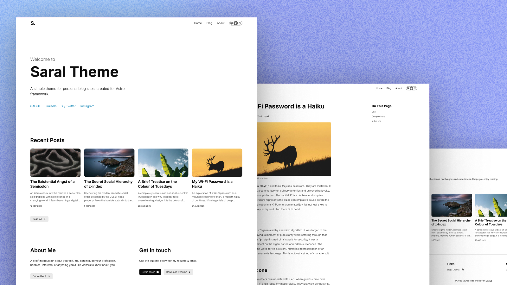

# Saral Theme

A simple & minimal theme for personal blog sites, crafted for Astro framework.

View demo at [https://yashjawale.github.io/saral-theme-astro/](https://yashjawale.github.io/saral-theme-astro/)

View in Astro themes at [https://astro.build/themes/details/saral/](https://astro.build/themes/details/saral/)

> Like what you see? Consider starring the repository 🌟

Derived from [yashjawale.github.io](https://yashjawale.github.io)

## Features

- Image optimization on build
- Accessible emojis
- Automatic reading time display for posts
- Automatic last update status for posts
- Dark mode support
- RSS feed
- Includes GitHub workflows for linting & formatting

## Getting started

- Clone this repository
- Install dependencies with `npm i`
- Start dev server with `npm run dev`
- Remove `<meta name="robots" content="noindex" />` tag from `src/components/BaseHead.astro` file
- Remove `.github/workflows/deploy.yml` if not deploying to [GitHub Pages](https://docs.github.com/en/pages)
- Update `base` value in `src/consts.ts` file - if your site is not in a subdirectory, make it empty string
- Update favicons & opengraph images ([realfavicongenerator.net](https://realfavicongenerator.net/) is a nice site to get the favicons cropped)
- Update page content & images
- Publish your site 🚀

## Adding a blog post

- Add `your-blog-post.md` file under `src/content/blog` (filename denotes the URL slug)
- Write content in file using Markdown syntax
- Add cover image at `src/assets/blogimages/<YOUR_SLUG>/cover.jpg` - Recommended dimensions: `853x480px`
- For adding images to content, use the folowing syntax for caption support ``
- Create a PR & merge after passing workflow checks

> [!TIP]
> Facing any issues or want a feature? Feel free to create a new [issue](https://github.com/yashjawale/saral-theme-astro/issues)

---

